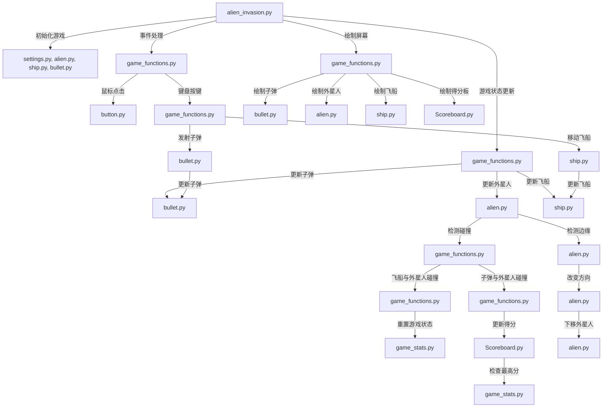

# 飞船小游戏
[English](README_en.md)

## 游戏介绍

这是一个简单的飞船小游戏，玩家需要控制飞船击落障碍物，并获取得分。
本项目基于python入门实战一书。

## 游戏玩法

- 使用键盘上的方向键控制飞船的移动。
- 避免与障碍物碰撞，否则游戏结束。
- 每次击落障碍物，得分增加，速度也会加快。

## 项目文件说明
```shell
.
│   .gitignore
│   alien.py
│   alien_invasion.py # 程序入口，从这里启动
│   bullet.py # 子弹
│   button.py # 游戏开始按钮
│   game_functions.py
│   game_stats.py # 游戏状态
│   LICENSE
│   README.md
│   scoreboard.py # 计分板
│   settings.py # 游戏设置
│   ship.py
│
└───images
        alien.bmp # 外星人图片
        luoxuanwan.bmp # 子弹
        naruto.bmp # 飞船1
        ship.bmp # 飞船2
```

## 游戏流程图



## 游戏运行示例


## 许可证说明
本项目基于 MIT 许可证发布。