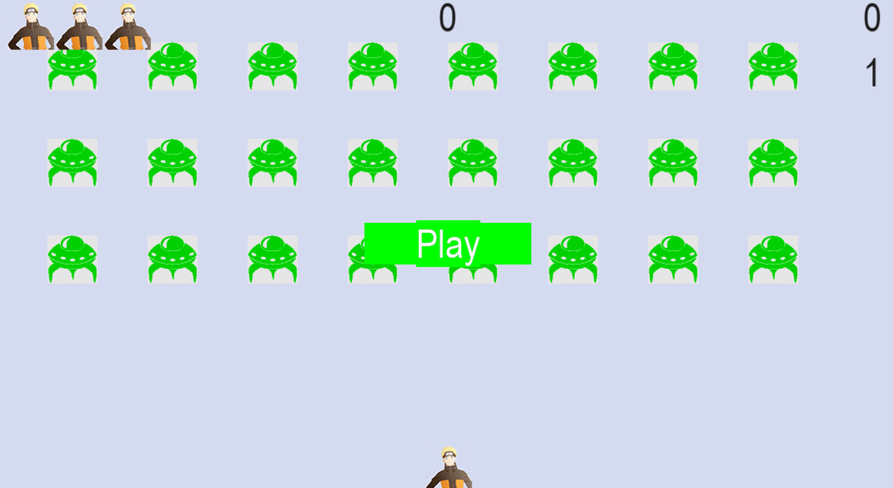

# Spaceship Game
[English](README_en.md)

## Game Introduction

This is a simple spaceship game where players need to control the spaceship to shoot down obstacles and score points. This project is based on the book "Python Beginner Practical Battle".

## How to Play

- Use the arrow keys on the keyboard to control the movement of the spaceship.
- Avoid collisions with obstacles, otherwise the game will end.
- Each time an obstacle is shot down, the score increases and the speed also increases.

## Project File Description
```shell
.
│   .gitignore
│   alien.py
│   alien_invasion.py # Program entry point, start from here
│   bullet.py # Bullet
│   button.py # Game start button
│   game_functions.py
│   game_stats.py # Game status
│   LICENSE
│   README.md
│   scoreboard.py # Scoreboard
│   settings.py # Game settings
│   ship.py
│
└───images
        alien.bmp # Alien image
        luoxuanwan.bmp # Bullet
        naruto.bmp # Spaceship 1
        ship.bmp # Spaceship 2
```

## Game Play Example


## License Description
This project is released under the MIT License.